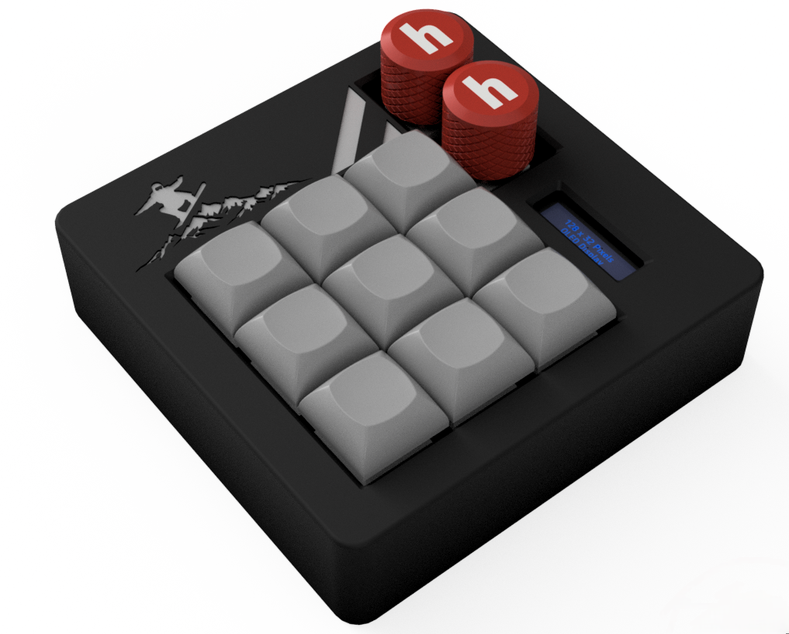
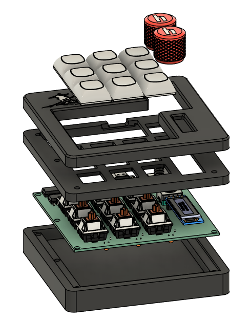
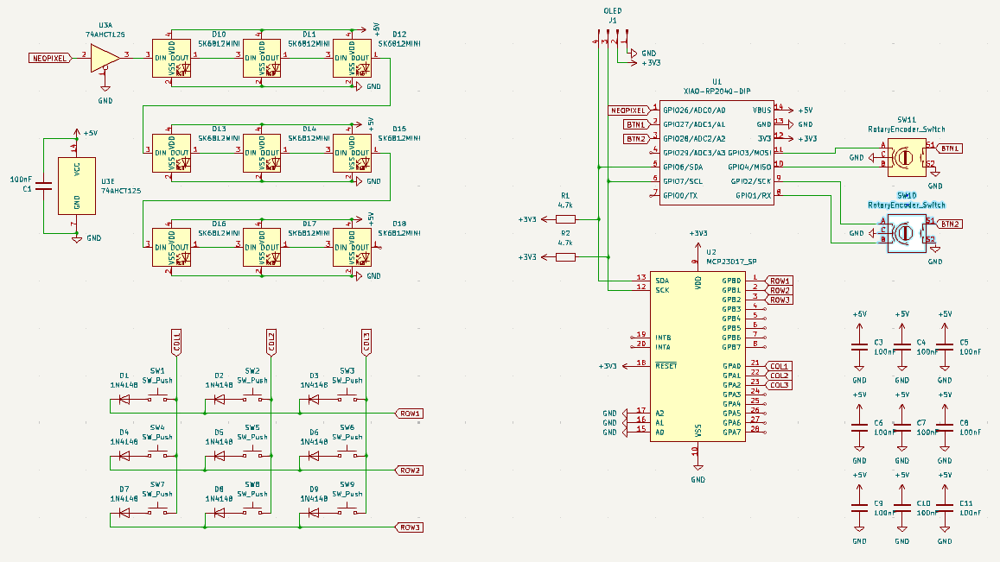
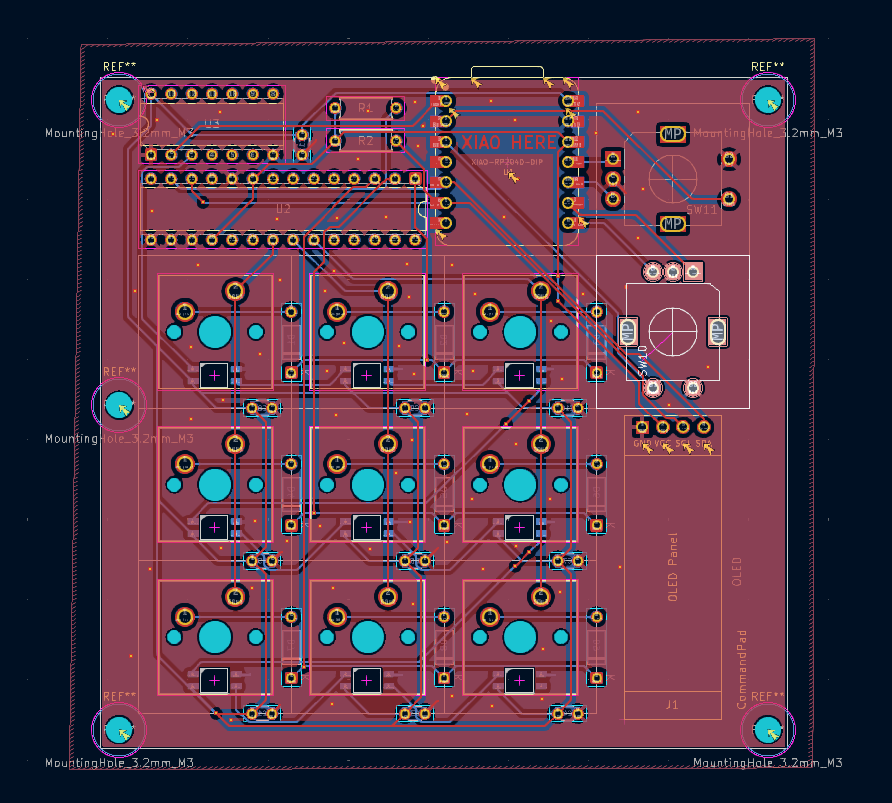

# CommandPad  

Mechanical macropad utilizing the Seeed XIAO RP2040. Has 9 keys plus two rotary encoders, an OLED display, and sk6812 mini-e leds under each key.
CommandPad uses kmk firmware and an optional companion app that allows the OLED display to include information about volume and song titles.

## CAD

There are three 3D printed pieces that fits together using M3 bolts and heatset inserts. The bottom piece holds the pcb, the middle holds the switches, and the top makes it look nice. There is a hole on the back side for a usb plug to utilize CommandPad. The snowboarder sillouette is featured since snowboarding is cool. The case was fully designed in Fusion360. The PCB model was exported from KiCad as a reference.

## PCB

The PCB was designed in KiCad.

## Firmware

CommandPad uses KMK to power everything.

- The 3x3 matrix acts as customizable hotkeys currently set to f13 to f21
- The 2 rotary encoders act as a volume control and horizontal scroll wheel
    - Pressing them is by default set to f22 and f23 but it can be change to play/pause, mute, etc.
- The OLED screen stays dark until you change volume or play music with the companion app runnning. Then it will show your volume level or the title of the current song (scrolls if it is too long)

## BOM

| Item                        | Quantity | Type/Details                |
|-----------------------------|----------|-----------------------------|
| Cherry MX Switches          | 9        | Mechanical switches         |
| Blank DSA Keycaps           | 9        | Keycaps                     |
| M3x5x4 Heatset inserts      | 5        | Hardware                    |
| M3x16mm SHCS Bolts          | 5        | Hardware                    |
| 1N4148 DO-35 Diodes         | 9        | Through hole                |
| Through hole resistors      | 2        | 4.7k                        |
| Through hole capacitors     | 9        | 100nF (0.1uF)               |
| SK6812 MINI-E LEDs          | 9        | RGB LEDs                    |
| 0.91" 128x32 OLED Display   | 1        | Display                     |
| EC11 Rotary Encoder         | 2        | Rotary encoder              |
| Seeed XIAO RP2040           | 1        | Through hole                |
| MCP23017                    | 1        | Through hole                |
| 74AHCT125                   | 1        | Through hole                |
| PCB                         | 1        | Printed circuit board       |
| Case (3 printed parts)      | 1        | 3D printed enclosure        |
